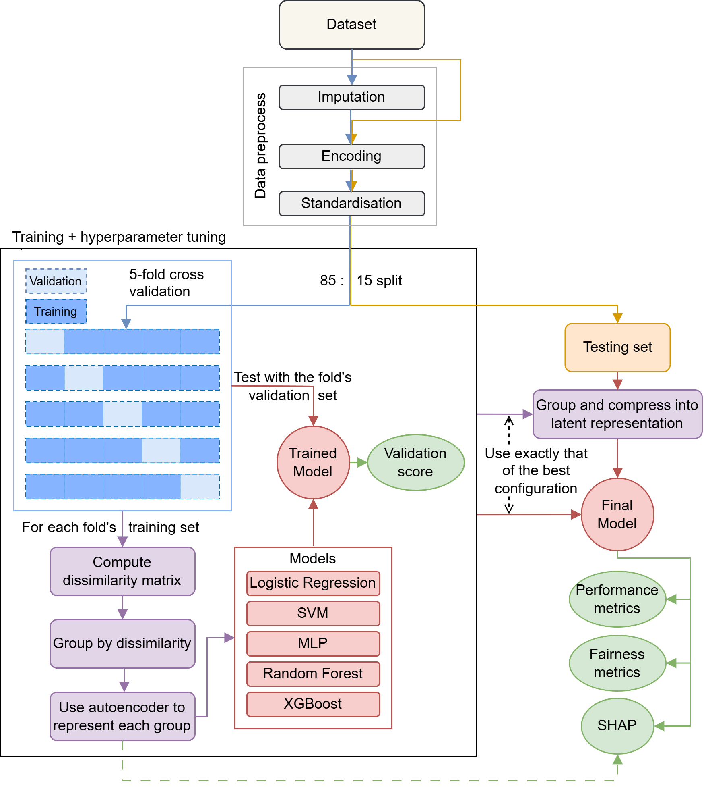

# SHIELD
**SH**apley and **I**nformation-theory based framework for **E**quitable **L**earning via **D**issimilar feature grouping

*This research is currently incomplete.* 

## Pipeline:

## Performance and Fairness results:

